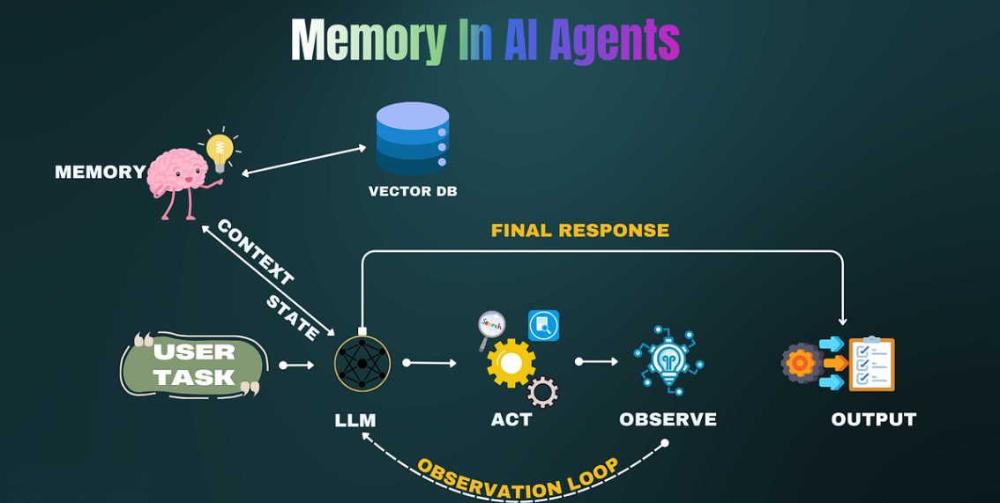
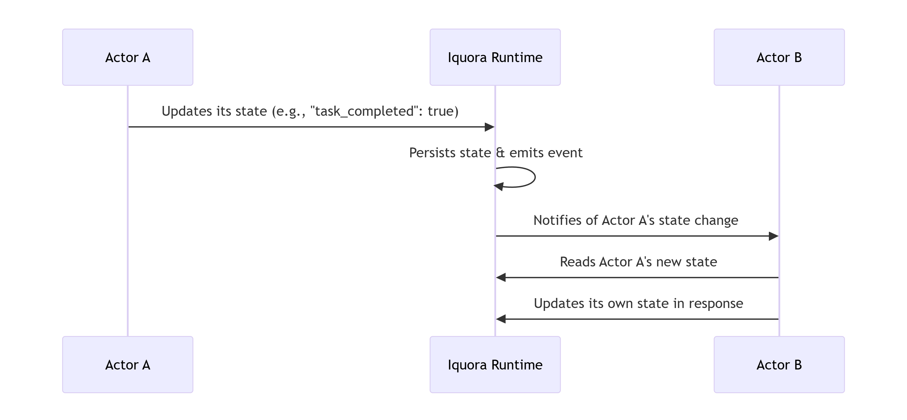

# Iquora

## A Distributed, Actor-Aware State Runtime for AI Agents & Microservices.

Iquora is an high-performance state store and runtime engineered from the ground up for the age of AI and event-driven microservices. It moves beyond simple key-value storage to natively manage stateful actors, providing durability, seamless communication, and effortless scaling.

### The Problem: The Stateful System Struggle
Building stateful, intelligent applications like AI agents or complex workflows today requires duct-taping multiple systems that weren't designed to work together.



You end up managing:
- State Persistence in a database.
- Fast Lookups in a cache (e.g., Redis).
- Communication via a separate pub/sub system.
- Orchestration Logic in your own code.

## Iquora Solution: Stateful Actors, Simplified
Iquora provides a unified runtime where your application's components—whether AI agents, user sessions, or workflow steps—are modeled as stateful actors. Each actor has its own durable state, lifecycle, and the ability to communicate efficiently with others.

## Core Concepts
1. Actors & State:
Every entity in your system is an actor with a unique ID and persistent state.
    ```
    {
    "id": "customer_session_123",
    "state": {
        "user_id": 123,
        "conversation_history": [...],
        "cart_items": [...],
        "current_state": "awaiting_payment"
        }
    }
    ```

2. Durable & Fast: Iquora uses a Write-Ahead Log (WAL) and state snapshots to guarantee durability without sacrificing the low-latency reads you expect from a cache. Your data is safe and instantly accessible.

3. Event-Driven Communication: Actors communicate via a built-in, persistent pub/sub system based on state changes, not just ephemeral messages.

4. Sidecar-Native Deployment: Run Iquora as a sidecar alongside your service in Kubernetes. It's lightweight, polyglot (works with any language via gRPC), and seamlessly integrates into cloud-native environments.



| Features | Description |
| :--- | :--- |
| 🎯 **Actor-Aware** | Native support for actor lifecycles (spawn, resume, terminate). |
| ⚡ **High Performance** | Sub-millisecond reads, powered by an efficient, concurrent engine. |
| 💾 **Durable by Design** | WAL and snapshots ensure state survives crashes and restarts. |
| 📡 **Event-Driven Pub/Sub** | Subscribe to state changes for powerful, reactive architectures. |
| 🌐 **Polyglot** | gRPC interface means any language can be a client (Go, Python, JS, Rust, Java, C#). |
| ☁️ **Cloud-Native** | Designed as a sidecar for Kubernetes and distributed environments. |
| 🔒 **Secure** | Built-in ACL and RBAC for fine-grained access control. (Pending future work) |

## 🎯 Use Cases

### Perfect for: Chatbots, Autonomous AI Agents, LangChain Memory Backend, E-commerce, Financial Transactions, Data Pipelines, Gaming, IoT Platforms.       

## 🤝 Contributing
Passionate about distributed systems, stateful runtimes, and the future of AI infrastructure? I'd love your help!